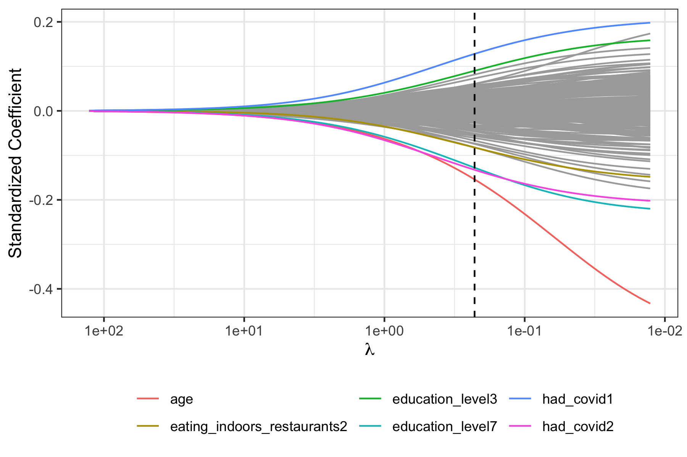
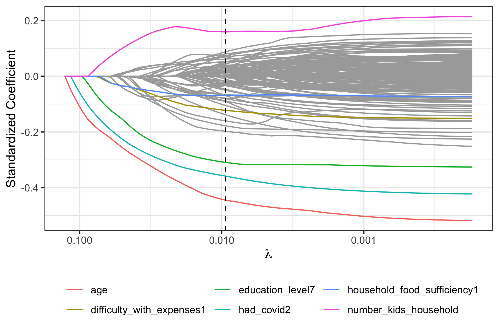
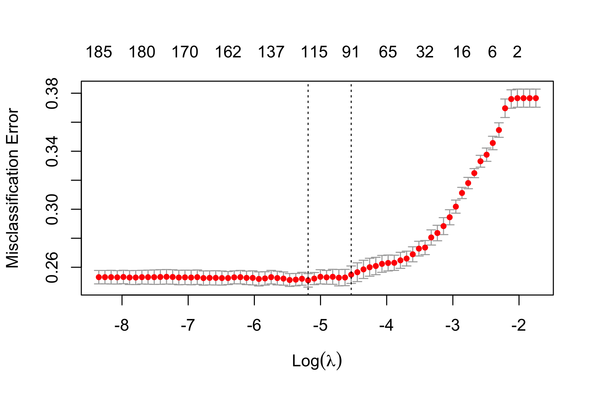
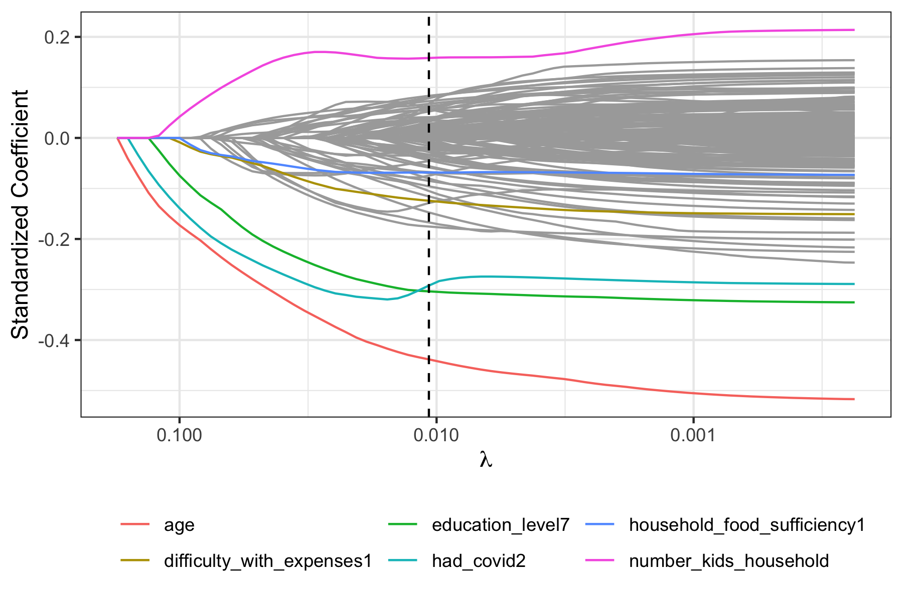
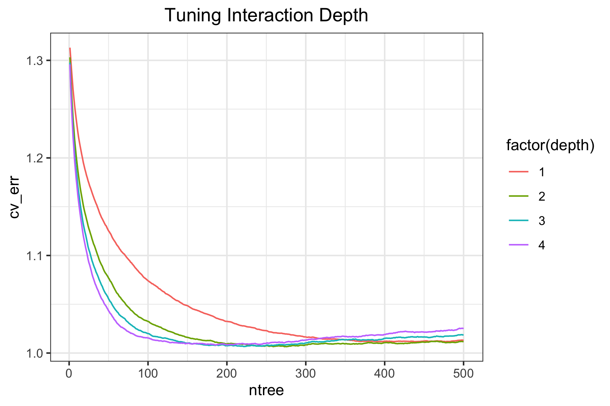

```{r setup, include=FALSE, message = FALSE}
options(scipen = 0, digits = 3)  # controls number of significant digits printed
library(tidyverse)
library(kableExtra)
```

\bigskip

The code to reproduce this report is available [on Github](https://github.com/williamxcheng/covid-vaccine-hesitancy).

\newpage

# Executive Summary

**Problem.** Despite the growing body of research focused on understanding COVID-19 vaccine hesitancy, there is still much to be learned about the factors that make some individuals more susceptible to COVID-19 vaccine hesitancy. Hence, for my final project, I decided to look into a wide range of social, economic, health, and lifestyle factors and analyze which factors were most predictive of vaccine hesitancy in individuals. In this project, I analyze data from the most recent collection period (September 29, 2021 - October 11, 2021) of the Household Pulse Survey conducted by the U.S. Census. While only analyzing data from this period inherently limits my results, the data within this short timeframe generally controls for a variety of external events that can affect vaccine hesitancy such as federal/employer vaccine mandates or the spread of new COVID variants. 

**Data.** My dataset pulled data from the Household Pulse Survey, a program by the U.S. Census. My explanatory variables span four main categories of factors: demographics (e.g. age, ethnicity, marital status), health (e.g. anxiety, depression), economic factors (e.g. health insurance coverage, income), and . My primary response variable of interest was the willingness to take the vaccine. 

**Analysis.** Before exploring the data or running any analyses, I split the data into a training dataset and a test dataset, with the training dataset used for building the predictive models and the test dataset used for assessing and comparing model performance. Then, I explored the data to check for class imbalance and to assess correlations between variables and between variables and the response. In order to build an optimal predictive model, I constructed six different models: logistic, ridge regression, LASSO regression, elastic net regression, decision trees, and boosting. Of the regression models, logistic regression had the lowest misclassification rate and of the tree-based models, the boosted model had the lowest misclassification rate. The logistic regression and the boosted model had near-identical misclassification rates.

**Conclusions.** Interestingly, we found that the boosted and elastic net regression both pointed to similar types of variables as the strongest predictors of deaths per cases. Specifically, our optimal boosted model revealed that variables related to residential segregation and unemployment emerged as the most significant predictors, revealing that structural economic and health access inequalities were more predictive of COVID-19 deaths per cases than other variables. We hope that this analysis can inform policies aimed at improving health outcome determinants, both in the context of COVID-19 and more generally going forward. 

# Introduction

**Background.** The ongoing pandemic of coronavirus (SARS-CoV-2) is already one of the deadliest pandemics in recent history. Since its initial discovery in 2019, the virus has infected over 274,628,461 million people and killed over 5,358,978 worldwide ^[https://covid19.who.int/]. In the United States, the virus has infected 51,110,283 people and killed 806,335 as of December 21, 2021 ^[https://www.nytimes.com/interactive/2021/us/covid-cases.html]. The pandemic has also led to one of the fastest developments of a vaccine as well as one of the largest vaccine rollouts in history ^[https://connect.uclahealth.org/2020/12/10/the-fastest-vaccine-in-history/]. That being said, there has been an increased spread in misinformation related to the COVID-19 vaccines and there are certain populations in the United States who have resisted getting vaccinated. The so-called “anti-vaccination” movement has negatively impacted herd immunity and has led to the increased spread of coronavirus variants. A thorough analysis of individuals who are hesitant about getting vaccinated can help inform strategies to improve vaccination rates within the United States to mitigate the COVID-19 pandemic as well as future pandemics and epidemics.

Past research has shown that vaccine hesitancy is a complex issue and can be influenced by a variety of factors. For instance, the World Health Organization outlined several determinants of vaccine hesitancy, including media environment, influential leaders, historical influences, geographic barriers, and the socio-economic factors ^[https://www.who.int/immunization/sage/meetings/2013/april/1_Model_analyze_driversofvaccineConfidence_22_March.pdf]. Despite these efforts to outline a framework for vaccine hesitancy, there is still much to be learned about the drivers of vaccine hesitancy because many of these determinants—such as media environment—can be difficult to measure.  

**Analysis goals.** Given the preexisting knowledge of the capacity for a variety of factors to influence vaccine hesitancy, I sought to investigate how social, economic, health, and lifestyle factors in particular influence vaccine hesitancy. Specifically, I was interested in which kinds of factors (social, economic, health, and lifestyle) and which specific variables were most predictive of vaccine hesitancy in individuals.

**Significance.** I hope that my analysis will contribute to the growing body of research on factors contributing to COVID-19 vaccine hesitancy, and I hope that they can be used to improve the efficacy of future vaccine rollouts. My results highlight the importance of analyzing social, economic, health, and lifestyle factors in efforts to understand vaccine hesitancy.

# Data

## Data sources

My dataset originated from the Household Pulse Survey conducted by the U.S. Census^[https://www.census.gov/programs-surveys/household-pulse-survey/datasets.html]. The Household Pulse Survey seeks to measure how the COVID-19 pandemic is impacting households across the country from a social and economic perspective. Specifically, along with measuring the intention of the respondent to get vaccinated for COVID-19, the Household Pulse Survey includes measures of demographics, economic welfare, and lifestyle factors. To construct my dataset, I pulled data from one collection period, amounting to the timeframe between September 29 to October 11, 2021. 

## Data cleaning

My first task in the data cleaning phase of the project was clean up some of the features in the raw dataset. This included the reduction in levels of several factor features, as well as the recoding of my response variable. Finally, I realized that there was a significant class imbalance in the raw data. The ratio of observations who were not hesitant to observations who were hesitant was 11 to 1. Thus, I utilized down-sampling so the ratio then became a more manageable 1.65 to 1. 

## Data description

### Observations

My dataset had a total of 10,230 observations, each corresponding to an individual respondent.

### Response Variable

My binary response variable signifies if an individual is hesitant or not hesitant about getting vaccinated for COVID-19.  I created this variable from two key measurements related to vaccine hesitancy that the raw dataset collected. The first measured if the respondent had already taken the COVID-19 vaccine, and if not, the second measured if the respondent intended on taking the vaccine. The second measurement had five separate levels: definitely, probably, unsure, probably not, or definitely not getting vaccinated. Thus, my recoded response variable was binary: an individual could be Hesitant (1) or Not Hesitant (0) about getting vaccinated. An observation was considered hesitant if the respondent had not taken the vaccine, and signified that they were unsure about getting vaccinated, probably not going to get vaccinated, or definitely not going to get vaccinated. An observation was considered not hesitant if the respondent had taken at least one dose of the vaccine or signified that they were definitely or probably going to get vaccinated.

### Features

Drawing on the data from the Household Pulse Survey, I included 62 explanatory variables in my analysis, which fall into four main categories: social, economic, health, and lifestyle. For a detailed specification of these variables, refer to Appendix \@ref(appendix).

## Data allocation

I split my dataset into two subsets: a training dataset used for building the predictive models and a test dataset used for evaluating the models. I utilized an 80-20 split, such that the training dataset consists of 80% of the observations and the test dataset consists of 20% of the observations. I set a random seed to ensure that any splits done would lead to the same results. 

## Data exploration

### Response

I first sought to understand the distribution of the response variable in the training dataset. As seen in the histogram of responses in Figure \@ref(fig:response-histogram), after utilizing my down-sizing method, there are 3082 observations that are vaccine hesitant, comprising 37.7% of the data, while there are 5102 observations that are not hesitant, comprising 62.3% of the data.

```{r response-histogram, out.width = "80%", fig.cap = "Distribution of responses", fig.align='center', echo = FALSE}

```

### Features

As my response was categorical and all my features apart from age were categorical with more than two levels, it was difficult to conduct additional preliminary analyses on the relationships between the response and the features.

# Modeling

## Regression-based methods

### Logistic regression

For the first model, I decided to fit a logistic regression with all 62 features to the training data. The logistic regression revealed that the following variables are significantly associated with the response at the 0.05 level: living in specific regions (South, Midwest, and West), being of Hispanic origin, being Black or Asian, having a bachelor's or graduate degree, sexuality (LGBTQ+), having a high number of people in the household, having prior exposure to COVID or potential prior exposure, having no to little difficulty with expenses, shopping in-store, receiving and using a SNAP receipt, having no private or public health insurance, living in a mobile-style home (mobile, boat, RV, van, etc.), having higher income, having to personally take on additional care for children, having at least one child attend private school or homeschool, and age. 

For the logistic model, Table \@ref(tab:logistic-confusion-matrix) shows the resulting confusion matrix. The performance metrics are listed in Table \@ref(tab:logistic-evaluation), shows that the model has a misclassification error rate of 0.250. The resulting false positive rate is 0.166 and the false negative rate is 0.386, which shows that the model could have lower sensitivity and higher specificity.

```{r logistic-confusion-matrix, out.width = "90%", fig.cap = "Lasso CV plot.", fig.align='center', echo = FALSE}
load("../results/logistic-confusion-matrix.RData")
logistic_confusion_matrix %>%
  kable(format = "latex", row.names = NA,
      booktabs = TRUE,
      caption = "The confusion matrix for the logistic regression") %>%
  kable_styling(latex_options = "HOLD_position")
```

```{r logistic-evaluation, out.width = "90%", fig.cap = "Logistic performance", fig.align='center', message = FALSE, echo = FALSE}
read_tsv("../results/logistic-evaluation.tsv") %>%
    kable(format = "latex", row.names = NA,
         booktabs = TRUE, digits = 3,
          col.names = c("Metric", "Classifier Performance"),
          caption = "The performance metrics of the logistic regression") %>%
    kable_styling(position = "center", latex_options = "HOLD_position")
```

### Penalized regression

While the logistic regression seemed to produce a model that worked well, fitting a logistic model with many explanatory variables can lead to high variance and suboptimal predictions. Thus, I decided to build and evaluate shrinkage models with the aim of reducing variance and obtaining a more accurate model. I ran three cross-validated regressions for which optimal values of lambda were chosen according to the one-standard-error rule: ridge regression, LASSO (Least Absolute Shrinkage and Selection Operator) regression, and elastic net regression. 

For the ridge regression, Figure \@ref(fig:ridge-CV-plot) shows the CV plot, Figure \@ref(fig:ridge-trace-plot) shows the trace plot, and Table \@ref(tab:ridge-coefficients) lists the top 10 features with the highest standardized coefficients. As seen from the trace plot and table of coefficients, the variables of age, education level, and having prior exposure to COVID seemed to have the greatest association with the response. 

The confusion matrix can be seen in Table \@ref(tab:ridge-confusion-matrix) and the performance metrics for the ridge regression can be seen in Table \@ref(tab:ridge-evaluation). The ridge model has a misclassification rate of 0.266, which is higher than the logistic regression. According to the false positive rate of 0.136 and the false negative rate of 0.480, the ridge regression seems to have higher specificity and lower sensitivity than the logistic regression. 

```{r ridge-CV-plot, out.width = "90%", fig.cap = "Ridge CV plot.", fig.align='center', echo = FALSE}

```

```{r ridge-trace-plot, out.width = "90%", fig.cap = "Ridge trace plot.", fig.align='center', echo = FALSE}

```

```{r ridge-coefficients, message = FALSE, echo = FALSE}
read_tsv("../results/ridge-features-table.tsv") %>%
  kable(format = "latex", row.names = NA,
        booktabs = TRUE, digits = 2,
        col.names = c("Feature", "Coefficient"),
        caption = "Standardized coefficients for the top 10 features in the 
        ridge model based on the one-standard-error rule.") %>%
  kable_styling(position = "center", latex_options = "HOLD_position")
```

```{r ridge-confusion-matrix, out.width = "90%", fig.cap = "Ridge confusion matrix.", fig.align='center', echo = FALSE}
load("../results/ridge-confusion-matrix.RData")
ridge_confusion_matrix %>%
  kable(format = "latex", row.names = NA,
      booktabs = TRUE,
      caption = "The confusion matrix for the ridge regression") %>%
  kable_styling(latex_options = "HOLD_position")
```

```{r ridge-evaluation, out.width = "90%", fig.cap = "Ridge performance", fig.align='center', message = FALSE, echo = FALSE}
read_tsv("../results/ridge-evaluation.tsv") %>%
    kable(format = "latex", row.names = NA,
         booktabs = TRUE, digits = 3,
          col.names = c("Metric", "Classifier Performance"),
          caption = "The performance metrics of the ridge regression") %>%
    kable_styling(position = "center", latex_options = "HOLD_position")
```

For the lasso, Figure \@ref(fig:lasso-CV-plot) shows the CV plot, Figure \@ref(fig:lasso-trace-plot) shows the trace plot, and Table \@ref(tab:lasso-coefficients) shows the selected features and their coefficients. Table \@ref(tab:ridge-evaluation) shows that the model has a misclassification rate of [].

[Interpretation of lasso omitted from this template. Other penalized regression methods omitted from this template.]

```{r lasso-CV-plot, out.width = "90%", fig.cap = "Lasso CV plot.", fig.align='center', echo = FALSE}

```

```{r lasso-trace-plot, out.width = "90%", fig.cap = "Lasso trace plot.", fig.align='center', echo = FALSE}

```

```{r lasso-coefficients, message = FALSE, echo = FALSE}
read_tsv("../results/lasso-features-table.tsv") %>%
  kable(format = "latex", row.names = NA,
        booktabs = TRUE, digits = 2,
        col.names = c("Feature", "Coefficient"),
        caption = "Standardized coefficients for features in the lasso
        model based on the one-standard-error rule.") %>%
  kable_styling(position = "center", latex_options = "HOLD_position")
```

```{r lasso-confusion-matrix, out.width = "90%", fig.cap = "LASSO confusion matrix.", fig.align='center', echo = FALSE}
load("../results/lasso-confusion-matrix.RData")
lasso_confusion_matrix %>%
  kable(format = "latex", row.names = NA,
      booktabs = TRUE,
      caption = "The confusion matrix for the LASSO regression") %>%
  kable_styling(latex_options = "HOLD_position")
```

```{r lasso-evaluation, out.width = "90%", fig.cap = "Lasso performance", fig.align='center', message = FALSE, echo = FALSE}
read_tsv("../results/lasso-evaluation.tsv") %>%
    kable(format = "latex", row.names = NA,
         booktabs = TRUE, digits = 3,
          col.names = c("Metric", "Classifier Performance"),
          caption = "The performance metrics of the LASSO regression") %>%
    kable_styling(position = "center", latex_options = "HOLD_position")
```

For the elastic net, Figure \@ref(fig:elnet-CV-plot) shows the CV plot, Figure \@ref(fig:elnet-trace-plot) shows the trace plot, and Table \@ref(tab:elnet-coefficients) shows the selected features and their coefficients. Table \@ref(tab:elnet-evaluation) shows that the model has a misclassification rate of [].

```{r elnet-CV-plot, out.width = "90%", fig.cap = "Elastic net CV plot.", fig.align='center', echo = FALSE}

```

```{r elnet-trace-plot, out.width = "90%", fig.cap = "Lasso trace plot.", fig.align='center', echo = FALSE}

```

```{r elnet-coefficients, message = FALSE, echo = FALSE}
read_tsv("../results/elnet-features-table.tsv") %>%
  kable(format = "latex", row.names = NA,
        booktabs = TRUE, digits = 2,
        col.names = c("Feature", "Coefficient"),
        caption = "Standardized coefficients for features in the elastic net
        model based on the one-standard-error rule.") %>%
  kable_styling(position = "center", latex_options = "HOLD_position")
```

```{r elnet-confusion-matrix, out.width = "90%", fig.cap = "Elastic net confusion matrix.", fig.align='center', echo = FALSE}
load("../results/elnet-confusion-matrix.RData")
elnet_confusion_matrix %>%
  kable(format = "latex", row.names = NA,
      booktabs = TRUE,
      caption = "The confusion matrix for the elastic net regression") %>%
  kable_styling(latex_options = "HOLD_position")
```

```{r elnet-evaluation, out.width = "90%", fig.cap = "Elastic net performance", fig.align='center', message = FALSE, echo = FALSE}
read_tsv("../results/elnet-evaluation.tsv") %>%
    kable(format = "latex", row.names = NA,
         booktabs = TRUE, digits = 3,
          col.names = c("Metric", "Classifier Performance"),
          caption = "The performance metrics of the elastic net regression") %>%
    kable_styling(position = "center", latex_options = "HOLD_position")
```

## Tree-based methods

[Omitted from template.]

### Decision trees

After fitting the regression models, I decided to fit two tree-based models: decision trees and random forest. 

With the decision trees, I fitted and pruned an optimal tree. This tree can be seen in Figure \@ref(fig:dt-plot). The confusion matrix for the decision tree can be seen in Table \@ref(tab:dt-confusion-matrix). The performance metrics can be seen in. 

```{r dt-plot, out.width = "90%", fig.cap = "Decision tree plot.", fig.align='center', echo = FALSE}

```

```{r dt-confusion-matrix, out.width = "90%", fig.cap = "Decision tree confusion matrix.", fig.align='center', echo = FALSE}
load("../results/dt-confusion-matrix.RData")
dt_confusion_matrix %>%
  kable(format = "latex", row.names = NA,
      booktabs = TRUE,
      caption = "The confusion matrix for the decision tree") %>%
  kable_styling(latex_options = "HOLD_position")
```

```{r dt-evaluation, out.width = "90%", fig.cap = "Decision tree performance", fig.align='center', message = FALSE, echo = FALSE}
read_tsv("../results/dt-evaluation.tsv") %>%
    kable(format = "latex", row.names = NA,
         booktabs = TRUE, digits = 3,
          col.names = c("Metric", "Classifier Performance"),
          caption = "The performance metrics of the decision tree") %>%
    kable_styling(position = "center", latex_options = "HOLD_position")
```

### Boosted

Next, I decided to fit a boosted model.

```{r boosted-cv-plot, out.width = "90%", fig.cap = "The CV error for the optimal boosted model", fig.align='center', echo = FALSE}

```

```{r boosted-confusion-matrix, out.width = "90%", fig.cap = "Boosted confusion matrix.", fig.align='center', echo = FALSE}
load("../results/boosted-confusion-matrix.RData")
boosted_confusion_matrix %>%
  kable(format = "latex", row.names = NA,
      booktabs = TRUE,
      caption = "The confusion matrix for the boosted model") %>%
  kable_styling(latex_options = "HOLD_position")
```

```{r boosted-features, message = FALSE, echo = FALSE}
read_tsv("../results/boosted-var-summary.tsv") %>%
  kable(format = "latex", row.names = NA,
        booktabs = TRUE, digits = 2,
        col.names = c("Variable", "Relative Influence"),
        caption = "The variable influence scores for the boosted model") %>%
    kable_styling(position = "center", latex_options = "HOLD_position")
```

```{r boosted-evaluation, out.width = "90%", fig.cap = "Boosted performance", fig.align='center', message = FALSE, echo = FALSE}
read_tsv("../results/boosted-evaluation.tsv") %>%
    kable(format = "latex", row.names = NA,
         booktabs = TRUE, digits = 3,
          col.names = c("Metric", "Classifier Performance"),
          caption = "The performance metrics of the boosted model") %>%
    kable_styling(position = "center", latex_options = "HOLD_position")
```

# Conclusions

## Method comparison

```{r model-evaluation, message = FALSE, echo = FALSE}
 read_tsv("../results/model-evaluation.tsv") %>%
   kable(format = "latex", row.names = NA,
         booktabs = TRUE, digits = 2,
         caption = "Summary of performance for all models") %>%
   kable_styling(position = "center", latex_options = "HOLD_position")
```

Table \@ref(tab:model-evaluation) shows the misclassification error, false positive rate, and false negative rate for all the methods considered. The logistic and the boosted model have the lowest misclassification errors at 0.25. While I expected the boosted model to have a low misclassification error due to the boosted model's tendency to have high predictive accuracy, the accuracy of the logistic model was unexpected. The ridge and LASSO regressions also have low misclassification errors at 0.26 each. The decision tree performed the worst out of all the models.

Even with these differences in misclassification error, the methods have significant overlap in their identification of important variables. Age was the most significant variable across nearly all the models, but other variables that were selected by more than one model included having a previous diagnosis of COVID, education level, and eating indoors in restaurants. 

## Takeaways

My results point to a few key factors that public health officials should consider when aiming to improve the COVID-19 vaccination rate in the United States. The boosted model, which had the strongest predictive performance, suggests that age is the most important variable in predicting an individual's vaccine hesitancy. This is corroborated by other models such as the decision tree, which also find that age is a significant predictor. Education level is also highly important in the boosted model, along with having prior exposure to COVID. These variables are identified across all models suggesting these relationships are robust. 

There are many possible ways that these results can be acted upon. For example, given that it seems that education levels are significant, public health officials can work to better explain how vaccination strengthens immune systems.

That being said, with the constant evolution of the COVID-19 pandemic as well as the inherent complexity of vaccine hesitancy, I am hesitant to make any assertive claims about the true predictive capacity of any of the top factors I identified. Nonetheless, these results can help inform policies directed toward improving vaccination rates across the US.

## Limitations

### Dataset limitations

Arguably the most significant limitation to my dataset is that vaccine hesitancy is an enormously complex and multifaceted issue. The dataset taken from the Household Pulse Survey does well at collecting base-level socioeconomic and demographic data, but there are a wide variety of factors that contribute to vaccine hesitancy that are not captured by this dataset. For example, the existence of pre-existing health issues is a significant cause for many to get vaccinated and it is a factor that is not captured by the Household Pulse Survey. 

Another one of the major limitations of my dataset is that the data was collected through only seven weeks in 2021. Changes to vaccine-related policies have happened frequently throughout the pandemic, mostly due to the rapid development of such vaccines. These changes can include the approval of new vaccines, the introduction of government or employer vaccine mandates or news about the efficacy of the vaccine against new variants like Omnicon. Thus, as the pandemic fluctuates, the interpretation of the analysis may not be as applicable to specific points in time other than the period where the data was collected. 

### Analysis limitations

One of the significant limitations to my analysis was the major class imbalance in the raw dataset. The ratio of people who were considered not hesitant to people who were considered hesitant was around 10 to 1. I was able to reduce this class imbalance through downsampling, but this likely affected the predictive accuracy of my models due to the reduction in the number of samples being processed through the training dataset.  

## Follow-ups

To compensate for the limitations listed above, I believe that more extensive analysis should be done as more data on vaccine hesitancy is collected. There are several ongoing data collection efforts that seek to collect a wider range of factors that can impact vaccine hesitancy. One particular study of interest is run by the University of Chicago, that aims to understand the preexisting health issues that affect one’s decision to get vaccinated or not. Other future work can include looking at factors of vaccine hesitancy in other countries.  

\appendix

# Appendix: Descriptions of features {#appendix}

Below are the 62 features we used for analysis. Words written in parentheses represent variable names. Unless noted otherwise, all variables are categorical.

**Social factors:** 

- *Demographics*
  - Region (`region`) Indicates the individual's Census Region. 1 indicates Northeast (including the states of Connecticut, Maine, Massachusetts, New Hampshire, New Jersey, New York, Pennsylvania, Rhode Island, and Vermont), 2 indicates South (Alabama, Arkansas, Delaware, District of Columbia, Florida, Georgia, Kentucky, Louisiana, Maryland, Mississippi, North Carolina, Oklahoma, South Carolina, Tennessee, Texas, Virginia, and West Virginia), 3 indicates Midwest (Indiana, Illinois, Iowa, Kansas, Michigan, Minnesota, Missouri, Nebraska, North Dakota, Ohio, South Dakota, and Wisconsin), and 4 indicates West (Alaska, Arizona, California, Colorado, Hawaii, Idaho, Montana, Nevada, New Mexico, Oregon, Utah, Washington, and Wyoming)
  - Race (`race`): Denotes race. 1 indicates White, 2 indicates Black, 3 indicates Asian, 4 indicates any other race or race in combination.
  - Hispanic (`hispanic`): Indicator of Hispanic origin. 1 indicates not of Hispanic origin, 2 indicates of Hispanic origin.
  - Education_level (`education_level`): Denotes educational attainment. 1 indicates less than high school, 2 indicates some high school, 3 indicates high school graduate or equivalent (for example GED), 4 indicates some college but degree not received or is in progress, 5 indicates associate’s degree (for example AA, AS), 6 indicates bachelor's degree (for example BA, BS, AB), 7 indicates graduate degree (for example master's, professional, doctorate).
  - Marital status (`marital_status`): Denotes marital status. 1 indicates married, 2 indicates widowed, 3 indicates divorced, 4 indicates separated, 5 indicates never married, -99 indicates question seen but category not selected, -88 indicates missing or did not report.
  - Birth gender (`birth_gender`): Denotes gender at birth. 1 indicates male, 2 indicates female.
  - Described gender (`described_gender`): Denotes current gender identity. 1 indicates male, 2 indicates female, 3 indicates transgender, 4 indicates none of the above, -99 indicates question seen but category not selected, -88 indicates missing or did not report.
  - Sexual orientation (`sexual_orientation`): Sexual orientation. 1 indicates gay or lesbian, 2 indicates heterosexual, 3 is bisexual, 4 is something else, 5 is doesn’t know, -99 is question seen but category not selected, -88 is missing or did not report.
  - Age (`age`): Denotes age of individual. This is a numerical feature.  
  
**Economic factors** 

- *Household*
  - Kids (`kids`): Indicates having kids in household (defined as 18 years or younger).
  - Number of kids (`number_kids_household`): Number of kids in household (defined as 18 years or younger). This is a numerical feature.  
  - Number of adults (`number_adults_household`): Number of adults in household (defined as 18 years or older). This is a numerical feature.  
  - Negative childcare impact (`pandemic_child_impact`): Indicator of negative effect on childcare due to pandemic. Childcare impact includes taking unpaid leave to care for children, using vacation, sick days, or paid leave in order to care for children, cutting work hours in order to care for children, leaving a job in order to care for the children, not looking for a job in order to care for the children, supervising one or more children while working, and so on. 1 indicates yes, 2 indicates no, -99 is question seen but category not selected, -88 is missing or did not report.
- *Employment*
  - Recent work loss (`recent_work_loss`): Indicator of recent household job loss within the past 4 weeks. 1 indicates yes, 2 indicates no, -99 is question seen but category not selected, -88 is missing or did not report.
  - Employment (`employment`): Indicator of any work done for either pay or profit over the past 7 days. 1 indicates yes, 2 indicates no, -99 is question seen but category not selected, -88 is missing or did not report.
  - Armed forces service (`active_duty`): Indicator of the indvidual or their spouse serving in the U.S. Armed Forces (active duty, Reserve, National Guard). 1 indicates yes, 2 indicates no, -99 is question seen but category not selected, -88 is missing or did not report.
  - Essential worker (`essential_worker`): Indicates if individual is essential worker. Essential work are defined as working in hospitals, nursing and residential healthcare facilities, ambulatory healthcare, social service, education, first response, death care, correctional facility, food and beverage store, agriculture, forestry, fishing, hunting, manufacturing facilities, public transit, postal service, and so on. 1 indicates yes, 2 indicates no, -99 indicates question seen but category not selected, -88 indicates missing or did not report.
- *Financial Stability*
  - Child Tax Credit (`child_tax_credit`): Indicates the receipt of Child Tax Credit (CTC) payment(s) in the last 4 weeks. 1 indicates yes, 2 indicates no, -99 is question seen but category not selected, -88 is missing or did not report.
  - Difficulty with expenses (`difficulty_with_expenses`): Indicates difficulty with paying for usual household expenses, including but not limited to food, rent or mortgage, car payments, medical expenses, student loans, and so on. 1 indicates not at all difficult, 2 indicates a little difficult, 3 indicates somewhat difficult, 4 indicates very difficult, -99 indicates question seen but category not selected, -88 indicates missing or did not report.
  - Househood food sufficiency (`household_food_sufficiency`): Indicates household food sufficiency over the past 7 days. 1 indicates enough of the kinds of food (I/we) wanted to eat, 2 indicates enough, but not always the kinds of food (I/we) wanted to eat, 3 indicates  sometimes not enough to eat, 4 indicates often not enough to eat, -99 indicates question seen but category not selected, -88 indicates missing or did not report.
  - Received free food (`household_free_food`): Indicates if the individual or household recieved free groceries from a food pantry, food bank, church, or other place that helps with free food. 1 indicates yes, 2 indicates no, -99 is question seen but category not selected, -88 is missing or did not report.
  - Received SNAP benefits (`snap_receipt`): Indicates if the individual or household received benefits from the Supplemental Nutrition Assistance Program (SNAP) or the Food Stamp Program. 1 indicates yes, 2 indicates no, -99 is question seen but category not selected, -88 is missing or did not report.
  - Difficult paying energy bill (`energy_pay_trouble`): Indicates if the household has trouble paying the energy bill. 1 indicates almost every month, 2 indicates some months, 3 indicates 1 or 2 months, 4 indicates never, -99 indicates question seen but category not selected, -88 indicates missing or did not report.
  - Unsafe housing temperatures (`housing_unsafe_temp`): Indicates if the household keeps home at a temperature that is unsafe or unhealthy. 1 indicates almost every month, 2 indicates some months, 3 indicates 1 or 2 months, 4 indicates never, -99 indicates question seen but category not selected, -88 indicates missing or did not report.
  - Income (`income`): Denotes annual household income level. 1 indicates less than `$25,000`, 2 indicates between `$25,000` - `$34,999`, 3 indicates `$35,000` - `$49,999`, 4 indicates `$50,000` - `$74,999`, 5 indicates `$75,000` - `$99,999`, 6 indicates `$100,000` - `$149,999`, 7 indicates `$150,000` - `$199,999`, 8 indicates `$200,000` and above, -99 indicates question seen but category not selected, -88 indicates missing or did not report.
- *Education*
  - Summer educational catch-up activities (`summer_educational_catch_up`): Indicator of children having to attend summer educational catch-up activities. 1 indicates yes, 2 indicates no, -99 indicates question seen but category not selected, -88 indicates missing or did not report.
  - Changes to post-secondary education plan (`post_sec_edu_plan_changes`): Indicator of changes made to post-secondary education plan including canceled classes, classes in different formats, fewer classes being taken, more classes being taken, classes being taken from a different institution, changes to degree, and so on. 1 indicates yes, 2 indicates no, -99 indicates question seen but category not selected, -88 indicates missing or did not report.
  - Children enrolled in public school (`children_public_school`): Indicator that at least one child is enrolled in public school. 1 indicates yes, 2 indicates no, -99 indicates question seen but category not selected, -88 indicates missing or did not report.
  - Children enrolled in private school (`children_private_school`): Indicator that at least one child is enrolled in private school. 1 indicates yes, 2 indicates no, -99 indicates question seen but category not selected, -88 indicates missing or did not report.
  - Children homeschooled (`children_homeschool`): Indicator that at least one child is homeschooled. 1 indicates yes, 2 indicates no, -99 indicates question seen but category not selected, -88 indicates missing or did not report.
  - Post secondary classes (`post_secondary_classes`): Indicator that at least one member of household was planning to take post secondary classes. 1 indicates yes, 2 indicates no, -99 indicates question seen but category not selected, -88 indicates missing or did not report.
- *Housing*
  - Housing owned or rented (`housing_owned_rented`): Indicates if the individuals' housing is owned or rented. 1 indicates owned by individual or someone in the household free and clear, 2 indicates owned by individual or someone in the household with a mortgage or loan (including home equity loans), 3 indicates rented, 4 indicates occupied without payment of rent, -99 indicates question seen but category not selected, -88 indicates missing or did not report.
  - Housing building type (`building_type`): Indicates the individuals' housing type. 1 indicates a mobile home, 2 indicates a one-family house detached from any other house, 3 indicates Aa one-family house attached to one or more houses, 4 indicates a building with 2 apartments, 5 indicates a building with 3 or 4 apartments, 6 indicates a building with 5 or more apartments, 7 indicates a boat, RV, van, etc. -99 indicates question seen but category not selected, -88 indicates missing or did not report.
  - Caught up on rent (`rent_caught_up`): Indicates if the household is currently caught up on rent payments. 1 indicates yes, 2 indicates no, -99 is question seen but category not selected, -88 is missing or did not report.
  - Caught up on mortgage (`mortgage_caught_up`): Indicates if the household is currently caught up on mortgage payments. 1 indicates yes, 2 indicates no, -99 is question seen but category not selected, -88 is missing or did not report.
  - Housing pay confidence (`housing_pay_confidence`): Denotes confidence in ability to make next mortgage or rent payment on time. 1 indicates not at all confident, 2 indicates slightly confident, 3 indicates moderately confident, 4 indicates highly confident, 5 indicates payment is/will be deferred, -99 indicates question seen but category not selected, -88 indicates missing or did not report.
  - Application for emergency rental assistance (`rent_assistance_apply`): Indicates if the household applied for emergency. 1 indicates the household applied and received assistance, 2 indicates the household applied and is waiting for a response, 3 indicates the household applied and the application was denied, 4 indicates the household did not apply, -99 indicates question seen but category not selected, -88 indicates missing or did not report.
  - Eviction likelihood (`eviction_likelihood`): Indicates likelihood of eviction within the next two months. 1 indicates very likely, 2 indicates somewhat likely, 3 indicates not very likely, 4 indicates not likely at all, -99 indicates question seen but category not selected, -88 indicates missing or did not report.
  - Foreclosure likelihood (`foreclose_likelihood`): Indicates likelihood of eviction within the next two months. 1 indicates very likely, 2 indicates somewhat likely, 3 indicates not very likely, 4 indicates not likely at all, -99 indicates question seen but category not selected, -88 indicates missing or did not report.
- *Health insurance*
  - Private health insurance (`private_health_insurance`): Indicates if the individual has private health insurance. 1 indicates yes, 2 indicates no, 3 indicates missing or did not report.
  - Public health insurance (`public_health_insurance`): Indicates if the individual has public health insurance. 1 indicates yes, 2 indicates no, 3 indicates missing or did not report.
  
**Health factors:** 

- *Vaccination Status*
  - Vaccine hesitancy (`vaccine_hesitancy`): Indicator of intention on getting vaccine. 1 indicates will definitely get a vaccine, 2 indicates will probably get a vaccine, 3 indicates unsure about getting a vaccine, 4 indicates will probably not get a vaccine, 5 indicates will definitely not get a vaccine, -99 indicates question seen but category not selected, -88 indicates missing or did not report.
  - Had COVID-19 (`had_covid`): Indicator of doctor or provider diagnosis of COVID. 1 indicates yes, 2 indicates no, 3 indicates not sure, -99 indicates question seen but category not selected, -88 indicates missing or did not report.
- *Emotional well-being*
  - Anxiety (`anxious`): Denotes the individual's frequency of anxiety over previous 2 weeks. 1 indicates no anxiety, 2 indicates having anxiety for several days, 3 indicates having anxiety for more than half the days, 4 indicates having anxiety nearly every day, -99 indicates question seen but category not selected, -88 indicates missing or id not report.
  - Worry (`worry`): Denotes the individual's frequency of worry over previous 2 weeks. 1 indicates not being worried, 2 indicates being worried for several days, 3 indicates being worried for more than half the days, 4 indicates being worried nearly every day, -99 indicates question seen but category not selected, -88 indicates missing or id not report.
  - Losing interest (`interest`): Denotes the individual's frequency of having little interest in things over previous 2 weeks. 1 indicates no loss of interest, 2 indicates having little interest for several days, 3 indicates having little interest for more than half the days, 4 indicates having little interest nearly every day, -99 indicates question seen but category not selected, -88 indicates missing or id not report.
  - Depression (`down`): Denotes the individual's frequency of feeling depressed over previous 2 weeks. 1 indicates no feelings of depression, 2 indicates having feelings of depression for several days, 3 indicates having feelings of depression for more than half the days, 4 indicates having feelings of depression nearly every day, -99 indicates question seen but category not selected, -88 indicates missing or id not report.
- *Mental health*
  - Prescription medication for mental health (`prescription_mental_health`): Usage of prescription medication within the past 4 weeks. 1 indicates yes, 2 indicates no, -99 is question seen but category not selected, -88 is missing or did not report.
  - Mental health services (`mental_health_services`): Indicator of receiving counseling or therapy from a mental health professional within the past 4 weeks. 1 indicates yes, 2 indicates no, -99 is question seen but category not selected, -88 is missing or did not report.
  - No access to mental health services (`mental_health_not_get`): Indicator of needing counseling or therapy from a mental health professional within the past 4 weeks but not receiving it. 1 indicates yes, 2 indicates no, -99 is question seen but category not selected, -88 is missing or did not report.
- *Physical health*
   - Missed checkups for child (`child_missed_checkups`): Children in household missed or delayed preventive check-ups within the last 12 months. 1 indicates yes, 2 indicates no, -99 is question seen but category not selected, -88 is missing or did not report.
   - Seeing limitations (`seeing_limitations`): Indicator of having difficulty seeing, even when wearing glasses or contacts. 1 indicates no difficulty, 2 indicates some difficulty, 3 indicates a lot of difficulty, 4 indicates cannot do at all, -99 indicates question seen but category not selected, -88 indicates missing or did not report.
   - Hearing limitations (`hearing_limitations`): Indicator of having difficulty hearing, even when using a hearing aid. 1 indicates no difficulty, 2 indicates some difficulty, 3 indicates a lot of difficulty, 4 indicates cannot do at all, -99 indicates question seen but category not selected, -88 indicates missing or did not report.
   - Remembering limitations (`remembering_limitations`): Indicator of having difficulty remembering or concentrating. 1 indicates no difficulty, 2 indicates some difficulty, 3 indicates a lot of difficulty, 4 indicates cannot do at all, -99 indicates question seen but category not selected, -88 indicates missing or did not report.
   - Mobility limitations (`mobility_limitations`): Indicator of having difficulty walking or climbing stairs. 1 indicates no difficulty, 2 indicates some difficulty, 3 indicates a lot of difficulty, 4 indicates cannot do at all, -99 indicates question seen but category not selected, -88 indicates missing or did not report.
  
**Lifestyle factors:** 

- *Work*
  - Working onsite (`work_onsite`): Indicator of working onsite within the past 7 days by the individual or anyone in the household. 1 indicates yes, 2 indicates no, -99 is question seen but category not selected, -88 is missing or did not report.
  - Working from home (`work_from_home`): Indicator of working from home within the past 7 days by the individual or anyone in the household. 1 indicates yes, 2 indicates no, -99 is question seen but category not selected, -88 is missing or did not report.
- *Personal*
  - In-store shopping (`in_store_shopping`): Indicator of shopping in-store within the past 7 days by the individual or anyone in the household. 1 indicates yes, 2 indicates no, -99 is question seen but category not selected, -88 is missing or did not report.
  - Eating indoors at restaurants (`eating_indoors_restaurants`): Indicator of eating indoors at restaurants within the past 7 days by the individual or anyone in the household. 1 indicates yes, 2 indicates no, -99 is question seen but category not selected, -88 is missing or did not report.
  - In-home housekeeping or caregiving services (`in_home_housekeeping`): Indicator of having in-person housekeeping or caregiving services within the past 7 days by the individual or anyone in the household. 1 indicates yes, 2 indicates no, -99 is question seen but category not selected, -88 is missing or did not report.
 - *Health* 
   - In-person medical appointments (`in_person_medical_appointments`): Indicator of having in-person medical appointments within the past 7 days by the individual or anyone in the household. 1 indicates yes, 2 indicates no, -99 is question seen but category not selected, -88 is missing or did not report. 
   - Personal usage of telehealth (`telehealth_personal`): Personal use of telehealth or telemedicine within the past 4 weeks. 1 indicates yes, 2 indicates no, -99 is question seen but category not selected, -88 is missing or did not report.
   - Child's usage of telehealth (`telehealth_child`): Child's use of telehealth or telemedicine within the past 4 weeks. 1 indicates yes, 2 indicates no, -99 is question seen but category not selected, -88 is missing or did not report.